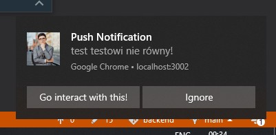
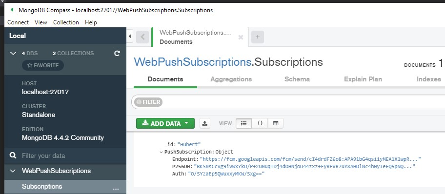

# WebPushApiDemo

This demo is walkthrough of [article](https://blog.elmah.io/how-to-send-push-notifications-to-a-browser-in-asp-net-core/) and reimplementing to .NET Core WebApi situation.

Frontend allow:
- register subscribtion in mongo db through api
- register push listener in chrome web brawoser

HTTP notification endpoint
- allow to sent notification to specified client

